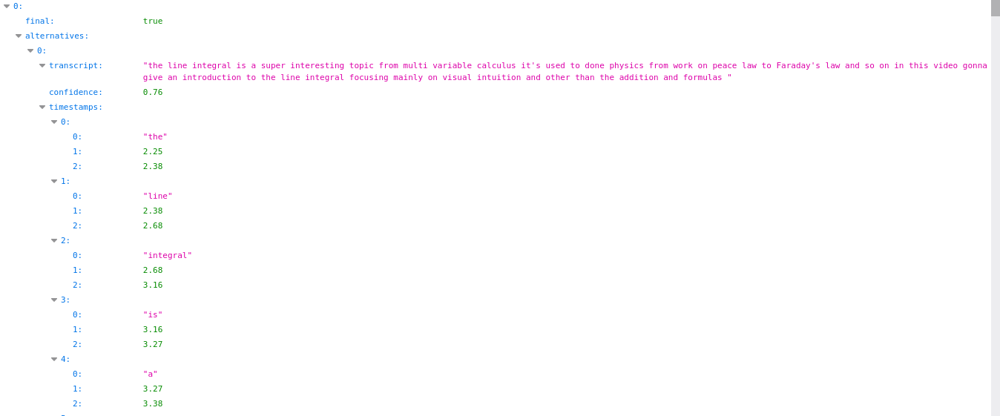

# AUDIO - PROCESSOR USING WATTSON

The purpose of this module is to take an audio file (MP3 format)
and take the Watson analysis so the next module can translate or make the suggest to the user
based on the original audio.

